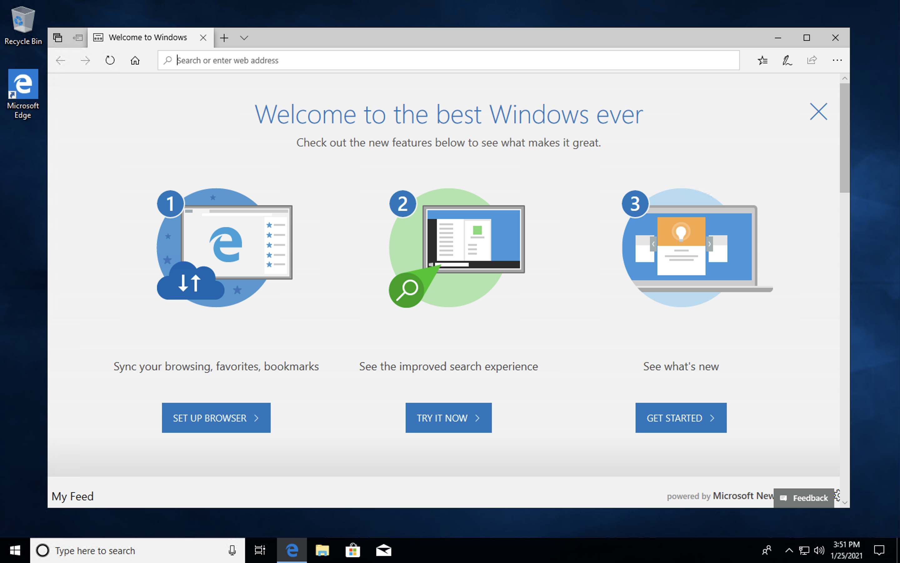
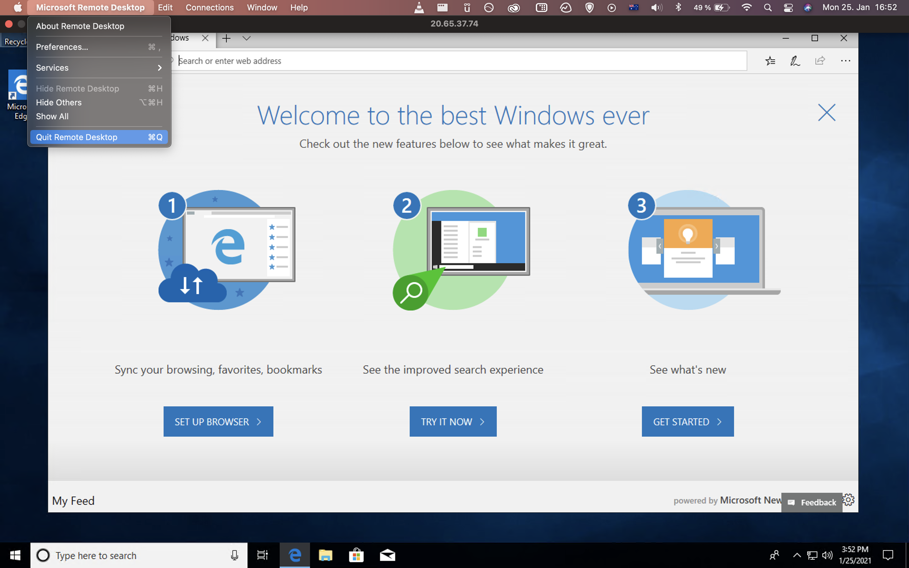

<p align="center">
<b><a href="#for-windows">Setup For Windows</a></b>
|
<b><a href="#for-macos/linux">Setup For MacOS/Linux</a></b>
</p>


# Azure for Researchers Setup 

### Introduction

Azure is a cloud computing service that offers a number of options for remote virtual machines with high computational performance and large RAM space - ideal for a number of research in econometrics, electricity modelling and data science. This guide 

## For Windows

Please follow the following steps if you use Windows operating system: 

### Step 1: Download and Install the Remote Desktop App 

The app is available on [Windows Store](https://www.microsoft.com/en-us/p/microsoft-remote-desktop/9wzdncrfj3ps?activetab=pivot:overviewtab) or [Mac Store](https://apps.apple.com/us/app/microsoft-remote-desktop/id1295203466?mt=12). 

### Step 2: Contact IT Department for your access credentials

The access credentials should include an IP address, your username and password. Please do not share these credentials with anyone. 

### Step 3: Open up the Remote Desktop App


### Step 4: Enter the Virtual Machine's Public IP address

Once you click on Add PC, you can enter the IP address provided to you by our IT team on the first field in the pop-up table. 


### Step 5: Enter your username and password

Double click on the small card just created. You can then input your username and password.


### Step 6: Enter your username and password


### Step 7: Accept the connection



### Step 8: Virtual Machine is launched 

The Windows Virtual Machine environment will be launched. You can install STATA, GAMS or any software for your computing needs with your own private workspace. 



## For MacOS/Linux

### Step 1: Contact IT Department for your access credentials

The access credentials should include a private key file (.pem file extension), your username and public IP to access the virtual machine. Please do not share these credentials with anyone! 

### Step 2: Access your Virtual Machine from your local machine

* Fire up your terminal
* Connect to your remote Virtual Machine on Azure:

```console
ssh -i <private key path> <user@server-instance> -L 8888:127.0.0.1:8888
```

8888 is the port on your local machine exclusively used by Jupyter Notebook. The -L 8888:127.0.0.1:8888 helps to create a tunnel from port 8888 in your local machine to port 127.0.0.1:8888 in the remote Virtual Machine. 

You will be asked: "Are you sure you want to continue connecting?" Type yes, and connection to the remote server on Azure will be established. 

### Step 3: Open a notebook kernel 

The image we use for Linux is the Data Science Virtual Machine Ubuntu for Azure. After everything is set up properly, you will have access to 6 different Python environment:
*    - py37_tensorflow                                                    
*    - py37_pytorch                                                       
*    - azureml_py36_tensorflow                                            
*    - azureml_py36_pytorch                                               
*    - azureml_py36_automl

The default environment is python37_default. You can switch to the other environment with the following command. Depending on your need, each environment will have a set of tools and libraries pre-installed and ready for your data science projects: 

```console
conda activate py37_tensorflow
```

To deactivate: 

```console
conda deactivate
```

To start up a Jupyter Notebook or Lab kernel: 

```console
jupyter notebook
```

or 

```console
jupyter lab
```

The notebook will be launched in port 127.0.0.1:8888, which you can visit by copying and pasting the link on the terminal to your browser. 